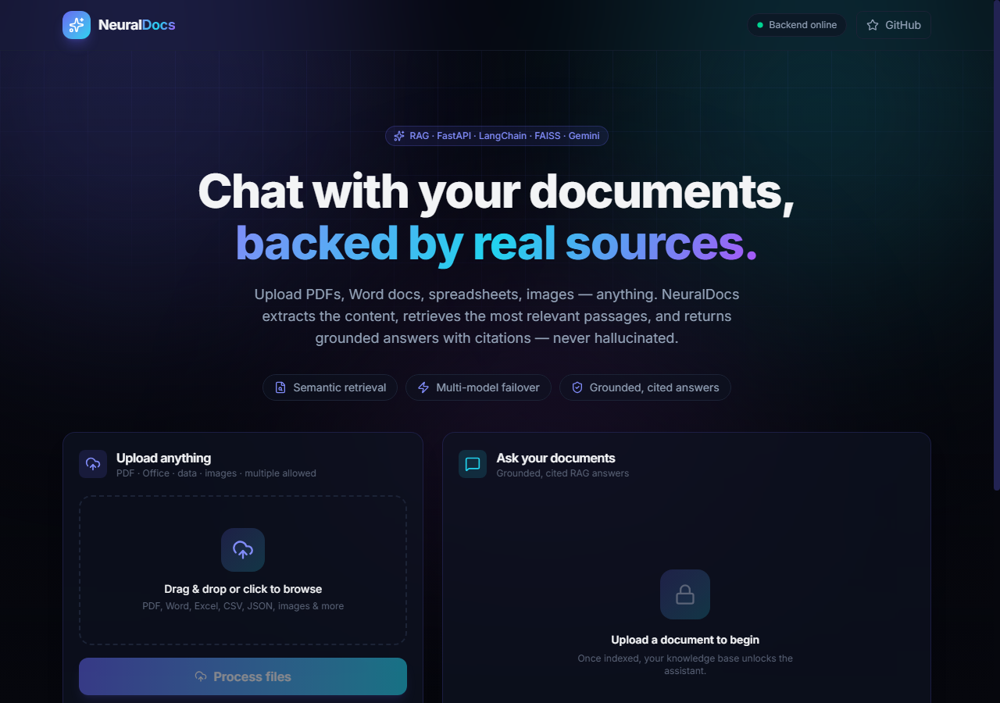

# 🚀 Infosys AI Document Search Platform

### Enterprise-grade AI Document Intelligence with RAG, Conversational Search, and Resilient Multi-Model Inference

---

## 🌐 Live Demo & Repository

- **Frontend:** deployed on Vercel via the root [vercel.json](vercel.json) (see your Vercel project URL)
- **Backend API:** deployed on Render via [render.yaml](render.yaml) (see your Render service URL)
- **GitHub Repository:** https://github.com/Krishna-Pratik/infosys-ai-document-search

---

## 🧠 Problem Statement

Organizations handle large volumes of PDFs and text documents containing policy details, technical specifications, domain knowledge, and operational instructions. Traditional keyword search fails in three critical ways:

- It misses semantic meaning and context.
- It cannot sustain natural multi-turn Q&A.
- It provides weak trust signals when answers are generated.

This project addresses a real enterprise challenge: enabling users to ask natural language questions over uploaded documents and receive precise, context-grounded answers with transparent source attribution.

---

## 💡 Solution Overview

Infosys AI Document Search Platform is a production-oriented Retrieval-Augmented Generation (RAG) system that combines:

- **Semantic retrieval** over embedded document chunks
- **Conversational LLM response generation**
- **Multi-model resilience** with dynamic fallback
- **Source-aware outputs** for traceability
- **Clean, premium React UI** optimized for first-time usability

The result is an AI assistant that behaves like an internal document analyst: fast, contextual, explainable, and robust under model/API failures.

---

## ✨ Key Features (Detailed)

### 1) Retrieval-Augmented Generation Pipeline
- Uploaded PDF/TXT documents are parsed, chunked, and transformed into semantic embeddings.
- Chunks are indexed in a FAISS-based vector store for high-speed nearest-neighbor retrieval.
- At query time, only relevant document context is passed to the LLM, reducing hallucination risk and improving factual alignment.

### 2) Conversational AI Experience
- Multi-turn chat interface allows users to ask follow-up questions naturally.
- Dialogue flow is optimized for practical exploration rather than one-shot search.
- Response UX includes clean message rendering and contextual continuity.

### 3) Multi-Model Fallback (Gemini -> OpenRouter)
- Primary inference path uses Google Gemini for high-quality generation.
- On quota/rate/config/provider errors, the system automatically rotates to OpenRouter-backed models.
- This significantly improves uptime and user experience in real-world API volatility.

### 4) Source Attribution and Transparency
- Answers are accompanied by source references (file/page metadata where available).
- Users can verify where insights come from, increasing confidence and auditability.
- Designed for use-cases where explainability matters.

### 5) Embedding-Based Semantic Search
- Retrieval is not limited to literal keyword matching.
- Similarity search captures conceptual intent, improving recall for paraphrased or technical queries.
- Better answer relevance across diverse document styles.

### 6) Production-Quality UI/UX
- Carefully polished visual hierarchy, spacing, and interaction flow.
- Above-the-fold layout optimized so key actions are visible without friction.
- Premium dark-themed interface designed for clarity and professional perception.

### 7) Performance and Reliability Optimizations
- Efficient chunking and retrieval pipeline for responsive querying.
- Lightweight UI rendering with practical state handling.
- Model fallback strategy reduces user-facing downtime and failed response scenarios.

---

## 🏗️ Architecture

### End-to-End Flow

**User -> Upload -> Chunking -> Embeddings -> Vector DB -> Retrieval -> LLM -> Response**

### Conceptual Pipeline

1. User uploads PDF/TXT files.
2. Loader extracts text content.
3. Splitter creates semantically manageable chunks.
4. Embedding model transforms chunks into vectors.
5. Vectors are stored/indexed in FAISS.
6. User query is embedded and matched to top-k relevant chunks.
7. Retrieved context is injected into the prompt.
8. LLM generates grounded answer.
9. UI returns answer + sources.

---

## 🔄 Multi-Model Strategy (Resilience by Design)

This project uses a practical reliability pattern suitable for production-like systems:

- **Primary model:** Google Gemini
- **Fallback path:** OpenRouter model(s), including dynamic fallback targets where configured
- **Failure handling:** rate-limit, quota, endpoint, or provider-level errors trigger controlled model rotation
- **Outcome:** reduced hard failures, better continuity, and improved user trust

Why this matters:
- AI APIs are not always deterministic in availability.
- A single-provider architecture introduces avoidable downtime.
- Model abstraction + fallback makes the platform robust and deployment-friendly.

---

## ⚡ Performance Optimizations

### Embedding and Retrieval Efficiency
- Chunking strategy tuned for retrieval quality and manageable context size.
- FAISS delivers fast approximate nearest-neighbor lookups.
- Context window usage is focused on relevant chunks, minimizing token waste.

### Runtime Responsiveness
- React interaction flow optimized for quick user feedback.
- Lean message rendering and compact metadata display.
- Error-tolerant model execution path avoids expensive full-stop failures.

---

## 📸 Screenshots

### Home / Chat UI

The conversational RAG interface: upload documents, ask natural-language questions, and get grounded answers with source attribution.

More screenshots to come:
- Chat UI with sources — suggested path: `assets/screenshots/chat-ui.png`
- Upload / indexing state — suggested path: `assets/screenshots/upload-ui.png`

Tip: Keep screenshots in consistent resolution (1280×900) for a premium look.

---

## 🛠️ Tech Stack

### Frontend
- React 19 + Vite 8
- Tailwind CSS 4, Framer Motion, sonner

### Backend
- Python + FastAPI (uvicorn ASGI server)

### AI/ML and Orchestration
- LangChain
- Google Gemini (primary model)

### Vector Database
- FAISS

### Model Gateway / APIs
- OpenRouter (fallback inference path)

### Utilities
- python-dotenv
- pypdf
- pandas
- requests

---

## 📂 Project Structure

- frontend-react/  
        React + Vite frontend (chat UI, upload zone, API client in src/lib/api.js)
- backend/  
        FastAPI application:
        - main.py — API endpoints: POST /upload, POST /query, GET /health
        - utils/ — modular pipeline:
            - loader.py, splitter.py, embeddings.py, rag_chain.py, model_manager.py, hash_utils.py
        - requirements.txt — Python dependencies
        - .env — API keys (never committed)
- vercel.json  
        Vercel deployment config (builds frontend-react)
- render.yaml  
        Render blueprint for the FastAPI backend
- README.md  
        Project documentation

Note: vectorstore/ and data/uploads/ are runtime artifacts created by the backend and are gitignored.

---

## 🚀 How to Run Locally

The app is two services: a FastAPI backend and a React frontend.

### 1) Clone the repository
- git clone https://github.com/Krishna-Pratik/infosys-ai-document-search.git
- cd infosys-ai-document-search

### 2) Backend (FastAPI)
- Create and activate a virtual environment inside backend/:
        - Windows (PowerShell): `cd backend; python -m venv .venv; .\.venv\Scripts\Activate.ps1`
        - macOS/Linux: `cd backend; python3 -m venv .venv; source .venv/bin/activate`
- Install dependencies: pip install -r requirements.txt
- Create a .env file in backend/ with your keys (see Environment Variables below).
- Launch the API: uvicorn main:app --host 127.0.0.1 --port 8000
- Verify: http://127.0.0.1:8000/health returns {"status":"ok"}

### 3) Frontend (React + Vite)
- cd frontend-react
- Install dependencies: npm install
- Launch dev server: npm run dev
- Open http://localhost:5173 — it talks to the backend at http://localhost:8000 by default.
  To point at a deployed API instead, set VITE_API_URL in frontend-react/.env.local.

### 4) Use the app
- Upload documents via the UI (POST /upload re-indexes the vector store).
- Ask questions in the chat panel (POST /query returns a grounded answer + sources).

---

## 🌍 Deployment Notes

- Vercel can now deploy the frontend from the repository root using the root-level [vercel.json](vercel.json).
- The frontend build runs from [frontend-react](frontend-react) and outputs to [frontend-react/dist](frontend-react/dist).
- Render should deploy the FastAPI backend from [backend](backend) using [render.yaml](render.yaml).

---

## 🔐 Environment Variables

Create a .env file in backend/ and define:

- GOOGLE_API_KEY=your_google_api_key
- OPENROUTER_API_KEY=your_openrouter_api_key

Optional model configuration may include:
- OPENROUTER_MODEL=preferred_model_identifier
- OPENROUTER_FALLBACK_MODELS=comma_separated_model_list

Security best practices:
- Never commit .env
- Rotate keys periodically
- Scope keys with minimum required permissions

---

## 📈 Key Learnings

Building this platform provided practical, product-level insights across AI engineering and UX:

- **Reliability is a feature:** fallback model architecture materially improves user trust.
- **RAG quality depends on preprocessing:** chunk strategy directly affects retrieval precision.
- **Transparent AI wins adoption:** source attribution is essential for enterprise confidence.
- **UX drives perceived intelligence:** spacing, hierarchy, and interaction clarity strongly influence user satisfaction.
- **Operational discipline matters:** secure secret handling and clean version control are non-negotiable for production readiness.
- **Modular architecture scales:** separating loader/splitter/embedding/retrieval/model layers enables rapid iteration and safer maintenance.

---

## 🔮 Future Improvements

- Role-based access control for enterprise teams
- Document collections and workspace-level isolation
- Hybrid retrieval (semantic + keyword + reranking)
- Advanced citation UX with clickable excerpt previews
- Async ingestion pipeline for large document batches
- Observability dashboards (latency, token usage, failure rates)
- Evaluation harness for retrieval precision and answer faithfulness
- Containerized deployment profiles and CI/CD pipelines
- Multi-tenant architecture for SaaS deployment
- Feedback loop for answer quality tuning

---

## 🤝 Acknowledgements

- **Infosys Springboard** for learning ecosystem and innovation motivation
- Open-source communities behind React, FastAPI, LangChain, and FAISS
- Developer ecosystem enabling rapid AI product prototyping and deployment

---

## ⭐ Support / Call to Action

If you found this project valuable:

- Star the repository: https://github.com/Krishna-Pratik/infosys-ai-document-search
- Fork and build your own document intelligence workflow
- Share feedback or open issues for improvements
- Connect with me: https://github.com/Krishna-Pratik

---

## 📄 License

This project is licensed under the MIT License. See LICENSE for details.
